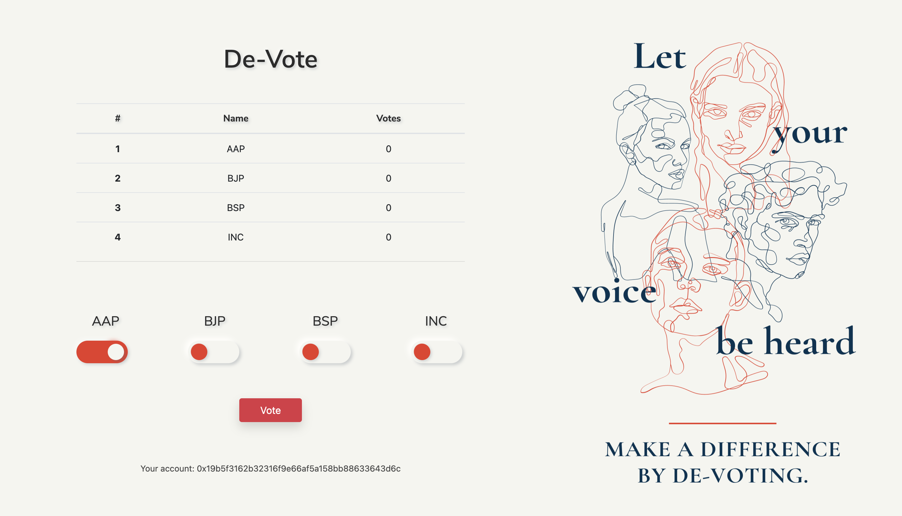

# DeVote

A decentralised election voting system created using blockchain technology that helps in conducting fair elections. The system uses the Ethereum blockchain, and smart contracts are written using the Solidity programming language.

The voting procedure is fully transparent and the votes are written on the blockchain (Fully tranparent here does not mean that the voter's identity is revealed). So, no one can change/swap the votes. This solves the problem of trust between the people and the election commission.

 
<b>Technologies used</b>

 
 

Solidity
 
JavaScript
 
Truffle
 
Ganache
 
ReactJS
 
Web3
 
Metamask
 
BootStrap
